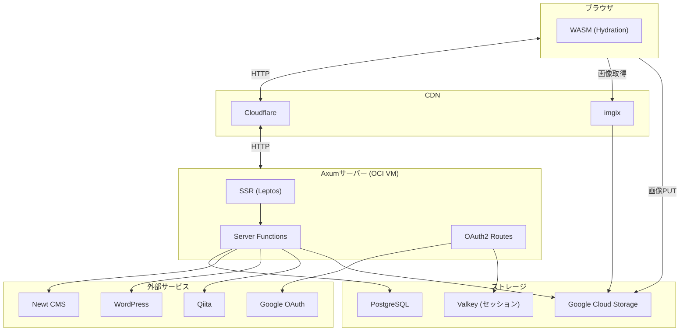

# 1. システム概要

## 1.1 目的

個人ブログ「blog.romira.dev」のコンテンツ管理システム。
複数のコンテンツソース（自前CMS、WordPress、Qiita）を統合して表示する。

## 1.2 対象ユーザー

| ユーザー種別 | 説明 |
|-------------|------|
| 閲覧者 | 記事を閲覧する一般ユーザー |
| 管理者 | 記事を作成・編集・公開する（Google Workspace認証済み） |

## 1.3 システムアーキテクチャ



## 1.4 技術スタック

| カテゴリ | 技術 | バージョン/備考 |
|---------|------|-------------|
| **言語** | Rust | nightly |
| **フレームワーク** | Leptos | 0.8.x（SSR + Hydration） |
| **HTTPサーバー** | Axum | 0.8.x |
| **DB** | PostgreSQL | sqlx 0.8（コンパイル時クエリ検証） |
| **セッション** | Valkey (Redis互換) | `tower-sessions` + Fred |
| **CSS** | Stylance | CSS Modules（`.module.scss`） |
| **ビルド** | cargo-leptos | 0.2.27 |
| **WASM** | wasm-bindgen | 0.2.100 |
| **フォーマッタ** | leptosfmt | 0.1.32 |
| **認証** | oauth2 クレート | Google OAuth 2.0 |
| **画像ストレージ** | GCS | google-cloud-storage |
| **画像CDN** | imgix | URL変換のみ |
| **実行環境** | OCI VM | systemd サービス |
| **CDN** | Cloudflare | DNS + HTTP プロキシ |
| **タスクランナー** | just | CI/ビルド/開発 |

## 1.5 ワークスペース構成

```
blog-romira-dev-leptos/
├── app/                    # Isomorphicライブラリ
│   └── src/
│       ├── common/         # 共有コード
│       │   ├── handlers.rs        # 公開API Server Functions
│       │   ├── handlers/admin/    # 管理API Server Functions
│       │   ├── handlers/auth/     # 認証API Server Functions
│       │   ├── dto.rs             # 公開DTO型
│       │   └── response.rs        # キャッシュ制御ラッパー
│       ├── front/          # UIコンポーネント・ページ
│       │   ├── app/               # Appコンポーネント・ルーティング
│       │   └── pages/             # 各ページコンポーネント
│       └── server/         # SSR専用コード (#[cfg(feature = "ssr")])
│           ├── auth.rs            # OAuth2 フロー
│           ├── config.rs          # 環境変数設定
│           ├── contexts.rs        # AppState (DI)
│           ├── http/              # HTTPユーティリティ
│           ├── models/            # 外部サービスモデル
│           └── services/          # 外部サービスクライアント
├── cms/                    # CMS層（DB操作・ビジネスロジック）
│   └── src/
│       ├── error.rs               # CmsError
│       ├── models.rs              # DBモデル
│       ├── queries/               # 読み取りクエリ
│       ├── repositories/          # 書き込み操作
│       ├── services/              # ビジネスロジック
│       └── value_objects/         # バリデーション値オブジェクト
├── front/                  # WASMエントリポイント
│   └── src/main.rs                # hydrate()
├── server/                 # Axumバイナリ
│   └── src/main.rs                # サーバー起動
├── style/                  # グローバルスタイル
└── docs/specification/     # 仕様書
```

## 1.6 Feature Flag

`ssr` と `hydrate` は相互排他のフィーチャーフラグ。同時有効化は不可。

| フラグ | 用途 | 有効なクレート |
|--------|------|-------------|
| `ssr` | サーバーサイドレンダリング・Server Function実行 | app, server |
| `hydrate` | クライアントサイドハイドレーション・イベントハンドラ | app, front |

**条件コンパイル**:
- `#[cfg(feature = "ssr")]` — DB操作、外部API呼び出し、認証処理
- `#[cfg(feature = "hydrate")]` — DOM操作、Cookie読み書き

## 1.7 features=local Cookie

開発・検証用のフィーチャーフラグ。Cookie `features=local` をブラウザに設定すると、以下の動作が変わる。

| 通常 | features=local |
|------|---------------|
| Newt CMS から記事取得 | ローカルDB から記事取得 |
| 記事ページキャッシュ有効 | キャッシュ無効化 |
| トップページにDB記事を含まない | トップページにDB記事を含む |

管理画面 (`AdminLayout`) の「ローカル記事表示」トグルで切り替え可能。
