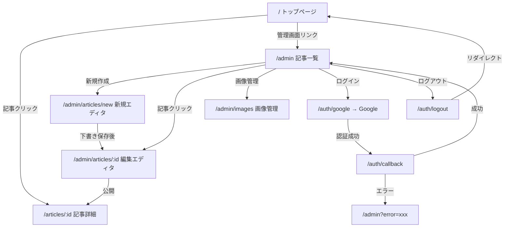

# 3. 画面仕様

## 3.1 ルーティング一覧

### フロントエンドルート（Leptos Router）

**定義**: `app/src/front/app/app_component.rs`

| パス | コンポーネント | SSR | 認証 | 説明 |
|------|-------------|:---:|:----:|------|
| `/` | `TopPage` | Async | 不要 | トップページ |
| `/articles/:id` | `ArticlePage` | Async | 不要 | 記事詳細 |
| `/preview/:id` | `PreviewArticlePage` | Async | 不要 | プレビュー |
| `/admin` | `ArticleListPage` | Async | UIガード | 管理トップ（記事一覧） |
| `/admin/articles` | `ArticleListPage` | Async | UIガード | 記事一覧 |
| `/admin/articles/:id` | `ArticleEditorPage` | Async | UIガード | 記事エディタ |
| `/admin/images` | `ImagesPage` | Async | UIガード | 画像管理 |

**フォールバック**: 上記に一致しないパスは `NotFoundPage` を表示。

### バックエンドルート（Axumルーター）

**定義**: `app/src/server/auth.rs` — `auth_routes()`

| パス | メソッド | ハンドラ | 説明 |
|------|---------|---------|------|
| `/auth/google` | GET | `auth_google` | OAuth開始 |
| `/auth/callback` | GET | `auth_callback` | OAuthコールバック |
| `/auth/logout` | GET | `auth_logout` | ログアウト |

---

## 3.2 画面遷移図

---

## 3.3 公開画面

### トップページ (`/`)

- **コンポーネント**: `TopPage`
- **API呼び出し**: `get_articles_handler()`, `get_author_handler()`
- **UI構成**:
  - 著者プロフィール（名前、アバター、説明文）
  - 記事カード一覧（サムネイル、タイトル、カテゴリ、投稿日）
  - 各カードは記事ソース（Newt/WordPress/Qiita/Local）に応じたリンク先
- **キャッシュ**: トップページキャッシュ（`features=local` 時はキャッシュ無効化）

### 記事詳細 (`/articles/:id`)

- **コンポーネント**: `ArticlePage`
- **API呼び出し**: `get_article_handler(id)`
- **UI構成**:
  - `ArticleResponse::Found` → 記事本文（HTML）、カバー画像、カテゴリ、投稿日
  - `ArticleResponse::Redirect` → クライアントサイドリダイレクト
  - `ArticleResponse::NotFound` → 404ページ
- **SEO**: OGPメタタグ（title, description, og:image, published_time）
- **キャッシュ**: 記事ページキャッシュ（`features=local` 時はキャッシュ無効化）

### プレビュー (`/preview/:id`)

- **コンポーネント**: `PreviewArticlePage`
- **API呼び出し**: `get_preview_article_handler(id)`
- **UI構成**: 記事詳細と同じレイアウト
- **キャッシュ**: キャッシュ無効化（`no-cache, no-store, private`）

---

## 3.4 管理画面

### 共通レイアウト — AdminLayout

**定義**: `app/src/front/pages/admin_page/layout.rs`

全管理画面で共通のレイアウトコンポーネント。

- **サイドバー**:
  - ロゴ（`/` へのリンク）
  - ナビゲーション: 「記事一覧」「新規作成」「画像管理」
  - 「ローカル記事表示」トグル（`features=local` Cookie 切り替え）
  - 認証セクション（ログイン/ログアウト/認証なし表示）
- **認証ガードUI**:
  - OAuth設定済み かつ 未認証 → ログインオーバーレイ表示
  - OAuth未設定 → 「認証なし」表示、操作可能
  - 認証済み → ユーザーメール + ログアウトリンク

### 記事一覧 (`/admin`, `/admin/articles`)

- **コンポーネント**: `ArticleListPage`
- **API呼び出し**: `get_admin_articles_handler()`
- **UI操作 → API → 結果**:

| UI操作 | API | 結果 |
|--------|-----|------|
| ページ表示 | `admin/get_articles` (GET) | 記事一覧表示（タイトル、状態、公開日時） |
| 記事クリック | — | `/admin/articles/{id}` に遷移 |
| 新規作成ボタン | — | `/admin/articles/new` に遷移 |

### 記事エディタ (`/admin/articles/new`, `/admin/articles/:id`)

- **コンポーネント**: `ArticleEditorPage`
- **API呼び出し**: `get_article_for_edit_handler(id)`（既存記事の場合）
- **UI構成**:
  - 入力フィールド: タイトル、スラッグ、本文（Markdown）、説明文、カバー画像URL
  - Markdownプレビュー
- **UI操作 → API → 結果**:

| UI操作 | 条件 | API | 結果 |
|--------|------|-----|------|
| 下書き保存 | 下書き記事 | `admin/save_draft` (POST) | 保存成功/エラー表示 |
| 公開 | 下書き記事 | `admin/publish_article` (POST) | 公開記事に変換、エディタ再読み込み |
| 保存 | 公開記事 | `admin/save_published` (POST) | 更新成功/バリデーションエラー表示 |

### 画像管理 (`/admin/images`)

- **コンポーネント**: `ImagesPage`
- **API呼び出し**: `get_images_handler()`
- **UI構成**:
  - アップロードエリア（ドラッグ&ドロップ + クリックでファイル選択）
  - 画像グリッド（サムネイル、ファイル名、サイズ、URLコピーボタン、削除ボタン）
- **UI操作 → API → 結果**:

| UI操作 | API | 結果 |
|--------|-----|------|
| ページ表示 | `admin/images` (GET) | 画像一覧表示 |
| ファイルドロップ/選択 | `admin/images/upload-url` (POST) → GCS PUT → `admin/images` (POST) | 画像アップロード完了、一覧更新 |
| URLコピー | — | imgix URLをクリップボードにコピー |
| 削除ボタン | `admin/images/delete` (POST) | DB削除、一覧更新 |
