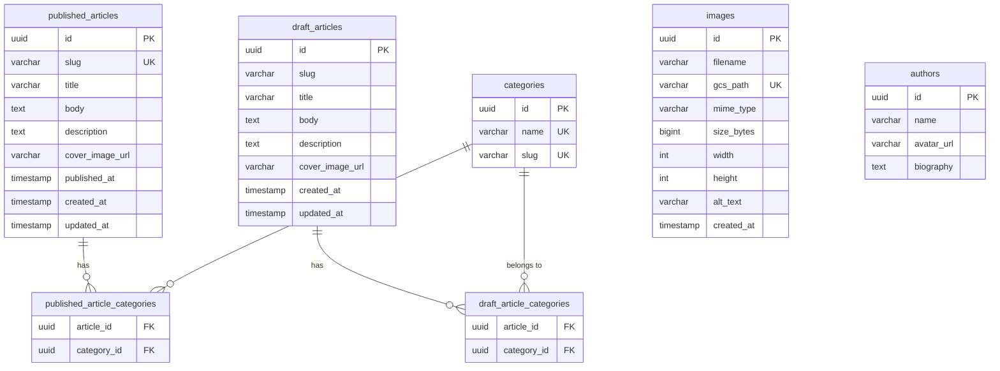

# 4. データ仕様

## 4.1 ER図

`images` テーブルと `authors` テーブルは他テーブルとの外部キー関係を持たない独立したテーブル。

---

## 4.2 テーブル定義

### published_articles（公開記事）

| フィールド | 型 | 必須 | 制約 | 説明 |
|-----------|-----|:----:|------|------|
| `id` | UUID | ○ | PK、自動生成 | 記事ID |
| `slug` | VARCHAR(255) | ○ | UNIQUE、`[a-z0-9\-_]+` | URLスラッグ |
| `title` | VARCHAR(255) | ○ | 1〜200文字 | 記事タイトル |
| `body` | TEXT | ○ | — | Markdown形式の本文 |
| `description` | TEXT | — | — | 記事説明文 |
| `cover_image_url` | VARCHAR(512) | — | URL形式 | カバー画像URL |
| `published_at` | TIMESTAMP | ○ | UTC | 公開日時（予約投稿対応） |
| `created_at` | TIMESTAMP | ○ | UTC、自動設定 | レコード作成日時 |
| `updated_at` | TIMESTAMP | ○ | UTC、自動更新 | レコード更新日時 |

### draft_articles（下書き記事）

| フィールド | 型 | 必須 | 制約 | 説明 |
|-----------|-----|:----:|------|------|
| `id` | UUID | ○ | PK、自動生成 | 記事ID |
| `slug` | VARCHAR(255) | ○ | 空文字許可 | URLスラッグ（公開時にバリデーション） |
| `title` | VARCHAR(255) | ○ | 空文字許可 | 記事タイトル |
| `body` | TEXT | ○ | 空文字許可 | Markdown形式の本文 |
| `description` | TEXT | — | — | 記事説明文 |
| `cover_image_url` | VARCHAR(512) | — | — | カバー画像URL |
| `created_at` | TIMESTAMP | ○ | UTC、自動設定 | レコード作成日時 |
| `updated_at` | TIMESTAMP | ○ | UTC、自動更新 | レコード更新日時 |

**相違点**: `draft_articles` には `published_at` がない。`slug` のUNIQUE制約もない。

### images（画像）

| フィールド | 型 | 必須 | 制約 | 説明 |
|-----------|-----|:----:|------|------|
| `id` | UUID | ○ | PK、自動生成 | 画像ID |
| `filename` | VARCHAR(255) | ○ | — | 元のファイル名 |
| `gcs_path` | VARCHAR(512) | ○ | UNIQUE | GCSオブジェクトパス |
| `mime_type` | VARCHAR(100) | ○ | 4種のみ | MIMEタイプ |
| `size_bytes` | BIGINT | ○ | 1 ≤ x ≤ 10,485,760 | ファイルサイズ（バイト） |
| `width` | INT | — | — | 画像幅（ピクセル） |
| `height` | INT | — | — | 画像高さ（ピクセル） |
| `alt_text` | VARCHAR(500) | — | — | 代替テキスト |
| `created_at` | TIMESTAMP | ○ | UTC、自動設定 | 登録日時 |

### categories（カテゴリ）

| フィールド | 型 | 必須 | 制約 | 説明 |
|-----------|-----|:----:|------|------|
| `id` | UUID | ○ | PK、自動生成 | カテゴリID |
| `name` | VARCHAR(100) | ○ | UNIQUE | カテゴリ名 |
| `slug` | VARCHAR(100) | ○ | UNIQUE | URLスラッグ |

### published_article_categories（公開記事-カテゴリ中間テーブル）

| フィールド | 型 | 必須 | 制約 |
|-----------|-----|:----:|------|
| `article_id` | UUID | ○ | FK → `published_articles.id`、ON DELETE CASCADE |
| `category_id` | UUID | ○ | FK → `categories.id`、ON DELETE CASCADE |

### draft_article_categories（下書き-カテゴリ中間テーブル）

| フィールド | 型 | 必須 | 制約 |
|-----------|-----|:----:|------|
| `article_id` | UUID | ○ | FK → `draft_articles.id`、ON DELETE CASCADE |
| `category_id` | UUID | ○ | FK → `categories.id`、ON DELETE CASCADE |

### authors（著者）

| フィールド | 型 | 必須 | 制約 |
|-----------|-----|:----:|------|
| `id` | UUID | ○ | PK、自動生成 |
| `name` | VARCHAR(100) | ○ | — |
| `avatar_url` | VARCHAR(512) | — | — |
| `biography` | TEXT | — | — |

---

## 4.3 CMS層モデル

### 基本モデル（`cms/src/models.rs`）

| モデル | テーブル | 説明 |
|-------|---------|------|
| `PublishedArticle` | `published_articles` | 公開記事の全フィールド |
| `DraftArticle` | `draft_articles` | 下書き記事の全フィールド |
| `Category` | `categories` | カテゴリの全フィールド |
| `Image` | `images` | 画像の全フィールド |

### 複合モデル

| モデル | 構成 | 説明 |
|-------|------|------|
| `PublishedArticleWithCategories` | `{ article: PublishedArticle, categories: Vec<Category> }` | 公開記事 + カテゴリ一覧 |
| `DraftArticleWithCategories` | `{ article: DraftArticle, categories: Vec<Category> }` | 下書き記事 + カテゴリ一覧 |
| `ArticleListItem` | `enum { Published(...), Draft(...) }` | 管理画面用の統合型 |

---

## 4.4 DTO定義

### 公開API用 DTO

| DTO | 用途 | フィールド |
|-----|------|----------|
| `HomePageArticleDto` | トップページ記事カード | `title`, `thumbnail_url`, `src`, `category`, `first_published_at`, `article_source` |
| `HomePageAuthorDto` | トップページ著者情報 | `name`, `avatar_url`, `description` |
| `ArticlePageDto` | 記事詳細ページ | `article_detail_dto`, `article_meta_dto` |
| `ArticleDetailDto` | 記事本文情報 | `title`, `cover_image_url`, `body`, `category`, `first_published_at` |
| `ArticleMetaDto` | SEOメタ情報 | `id`, `title`, `description`, `keywords`, `og_image_url`, `published_at`, `first_published_at` |
| `ArticleResponse` | 記事取得結果 | `Found(ArticlePageDto)`, `Redirect(String)`, `NotFound(())` |

### 管理API用 DTO

| DTO | 用途 | フィールド |
|-----|------|----------|
| `AdminArticleListItem` | 管理記事一覧 | `id`, `title`, `is_draft`, `published_at` |
| `ArticleEditData` | 記事編集データ | `id`, `title`, `slug`, `body`, `description`, `is_draft` |
| `ImageDto` | 画像情報 | `id`, `filename`, `gcs_path`, `mime_type`, `size_bytes`, `width`, `height`, `alt_text`, `imgix_url`, `created_at` |
| `GenerateUploadUrlResponse` | アップロードURL | `upload_url`, `gcs_path` |
| `RegisterImageResponse` | 画像登録結果 | `id`, `imgix_url` |

### 認証 DTO

| DTO | 用途 | フィールド |
|-----|------|----------|
| `AuthUser` | 認証ユーザー | `email`, `name`, `picture` |

---

## 4.5 データ変換規則

### 下書き → 公開記事（publish操作）

`PublishedArticleRepository::create_from_draft()` による変換:

| 下書きフィールド | 公開記事フィールド | 変換ルール |
|---------------|-----------------|----------|
| `slug` | `slug` | そのままコピー |
| `title` | `title` | そのままコピー |
| `body` | `body` | そのままコピー |
| `description` | `description` | そのままコピー |
| `cover_image_url` | `cover_image_url` | そのままコピー |
| — | `published_at` | 公開実行時の現在時刻（UTC） |
| — | `created_at` | 公開実行時の現在時刻（UTC） |
| — | `updated_at` | 公開実行時の現在時刻（UTC） |

**カテゴリコピー**: `draft_article_categories` のレコードを `published_article_categories` にコピー。

**下書き削除**: 変換完了後、`draft_articles` と `draft_article_categories` のレコードを削除。

**注意**: この一連の操作はトランザクションで囲まれていない。途中で失敗した場合、部分的にデータが残る可能性がある。

### 公開記事 → DTO変換

`PublishedArticleWithCategories` → `HomePageArticleDto`:
- `src` = `/articles/{slug}`
- `article_source` = `ArticleSource::Local`
- `first_published_at` = `published_at` を `%Y年%m月%d日` 形式（JST）に変換

`PublishedArticleWithCategories` → `ArticlePageDto`:
- `body` = Markdown → HTML 変換
- カテゴリ名の一覧を抽出
- メタ情報（title, description, OGP画像）を設定

---

## 4.6 タイムスタンプ仕様

| 項目 | 値 |
|------|-----|
| **保存形式** | `NaiveDateTime`（UTC、タイムゾーンなし） |
| **DB型** | `TIMESTAMP WITHOUT TIME ZONE` |
| **表示形式** | `%Y年%m月%d日`（JSTに変換して表示） |
| **現在時刻取得** | `chrono::Utc::now().naive_utc()` |

### 予約投稿

`published_at` を未来の日時に設定すると、その日時までフロント向けAPIの記事一覧・記事詳細で非公開となる。

- `PublishedArticleQuery::fetch_all()` — `WHERE published_at <= $1`（$1 = 現在時刻UTC）
- `PublishedArticleQuery::fetch_by_id()` — 同上
- `PublishedArticleQuery::fetch_by_slug()` — 同上
- `PublishedArticleQuery::fetch_by_id_for_admin()` — 時刻フィルタなし（管理画面用）
