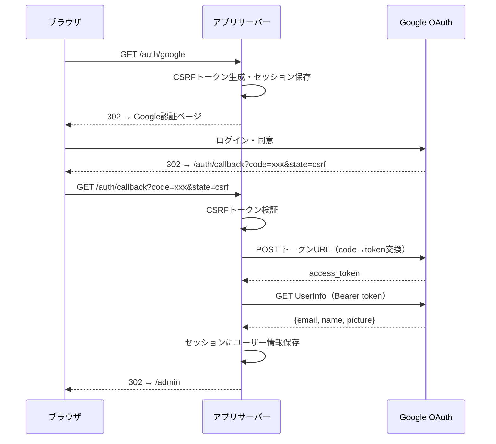

# 10. 認証・認可仕様

## 10.1 概要

Google OAuth 2.0 による管理者認証。Google Workspace の内部アプリとして設定されており、組織外ユーザーはログイン不可。

**重要な制約**: 管理APIエンドポイント（`admin/*`）にサーバーサイドの認証チェック（ミドルウェア / ガード）は存在しない。認証はUIレベルのオーバーレイのみで制御される。

---

## 10.2 OAuth2フロー詳細

### 前提条件（環境変数）

| 環境変数 | 説明 | 必須 |
|---------|------|:----:|
| `GOOGLE_CLIENT_ID` | OAuth2 クライアントID | ○（OAuth使用時） |
| `GOOGLE_CLIENT_SECRET` | OAuth2 クライアントシークレット | ○（OAuth使用時） |
| `APP_URL` | アプリケーションURL（コールバックURL構築用） | ○（OAuth使用時） |

3つすべてが設定されていない場合、OAuthは「未設定」として動作し、管理画面は認証なしでアクセス可能。

### Google OAuth2 エンドポイント

| 用途 | URL |
|------|-----|
| 認証URL | `https://accounts.google.com/o/oauth2/v2/auth` |
| トークンURL | `https://oauth2.googleapis.com/token` |
| UserInfo URL | `https://www.googleapis.com/oauth2/v2/userinfo` |

### OAuth2 フローシーケンス

### スコープ

| スコープ | 用途 |
|---------|------|
| `email` | メールアドレス取得 |
| `profile` | 表示名・プロフィール画像取得 |

### CSRF保護

1. `/auth/google` でランダムなCSRFトークンを生成
2. トークンをセッションに `oauth_csrf` キーで保存
3. Google認証URLの `state` パラメータにトークンを設定
4. `/auth/callback` でセッションのCSRFトークンと `state` クエリパラメータを照合
5. 不一致の場合は `/admin?error=csrf_mismatch` にリダイレクト

---

## 10.3 エラーコード

OAuthフロー中のエラーは、すべて `/admin?error={code}` へのリダイレクトで処理される。

| エラーコード | 発生タイミング | 説明 |
|------------|-------------|------|
| `oauth_not_configured` | `/auth/google` または `/auth/callback` | OAuth環境変数（client_id, client_secret, app_url）が未設定 |
| `session_error` | `/auth/google` または `/auth/callback` | セッションへの書き込み失敗（CSRF保存 or ユーザー保存） |
| `csrf_mismatch` | `/auth/callback` | CSRFトークン不一致（改ざんまたはセッション切れ） |
| `token_exchange_failed` | `/auth/callback` | 認証コード→アクセストークン交換失敗 |
| `userinfo_failed` | `/auth/callback` | Google UserInfo APIへのリクエスト失敗 |
| `userinfo_parse_failed` | `/auth/callback` | UserInfoレスポンスのJSON解析失敗 |

---

## 10.4 セッション管理

### セッションキー

| キー | 値の型 | 用途 |
|------|-------|------|
| `user` | `AuthUser { email, name, picture }` | 認証済みユーザー情報 |
| `oauth_csrf` | `String` | OAuth CSRF トークン（一時的、コールバック後に削除） |

### セッションストア

- **現在**: PostgreSQL（`tower-sessions-sqlx-store`）
- **将来**: Valkey（Redis互換）への移行予定

### Cookie設定

セッションCookieは `tower-sessions` のデフォルト設定に従う。

---

## 10.5 認証API

### auth/configured — OAuth設定有無確認

- **実装**: `app/src/common/handlers/auth/is_oauth_configured.rs`
- **判定条件**: `google_client_id`, `google_client_secret`, `app_url` の3項目すべてが `Some`
- **レスポンス**: `bool`

### auth/me — 認証ユーザー取得

- **実装**: `app/src/common/handlers/auth/get_auth_user.rs`
- **処理**: セッションから `user` キーを取得
- **レスポンス**: `Option<AuthUser>`（未認証時は `None`）

---

## 10.6 UIレベル認証ガード

**実装**: `app/src/front/pages/admin_page/layout.rs` — `AdminLayout` コンポーネント

### 動作

1. `is_oauth_configured()` で OAuth 設定有無を取得
2. `get_auth_user()` で認証ユーザーを取得
3. 以下の条件でUI表示を分岐:

| OAuth設定 | 認証状態 | 表示 |
|----------|---------|------|
| 未設定 | — | 「認証なし」表示。管理画面にそのままアクセス可能 |
| 設定済み | 認証済み | ユーザーメール表示 + ログアウトリンク |
| 設定済み | 未認証 | 管理画面コンテンツの上にログインオーバーレイを表示 |

### ログインオーバーレイ

- **CSSクラス**: `login_overlay` + `login_required`
- **内容**: 「ログインが必要です」メッセージ + 「Googleでログイン」ボタン
- **動作**: コンテンツは裏に描画済みだが、オーバーレイで操作不能にする

### features Cookie管理

`AdminLayout` には `features=local` Cookie の切り替えトグルが含まれる。

- **ON**: `document.cookie = "features=local; path=/"` を設定
- **OFF**: Cookie を削除（`max-age=0`）
- **クライアントサイドのみ**: `#[cfg(feature = "hydrate")]` ガード

---

## 10.7 セキュリティ上の制約

| 制約 | 説明 | リスク |
|------|------|-------|
| サーバーサイド認証チェック不在 | 管理APIは認証ミドルウェアなしで直接呼び出し可能 | APIのURLを知っていれば未認証でもデータ変更可能 |
| UIレベルガードのみ | CSSオーバーレイによる操作制限（DevToolsで回避可能） | UIガードはセキュリティ境界ではない |
| Google Workspace制限 | 組織外ユーザーはGoogleログイン不可 | Google Workspace設定に依存 |
| ログアウト処理 | サーバーサイドセッション削除のみ（Googleトークン無効化なし） | Googleセッションは残る |
