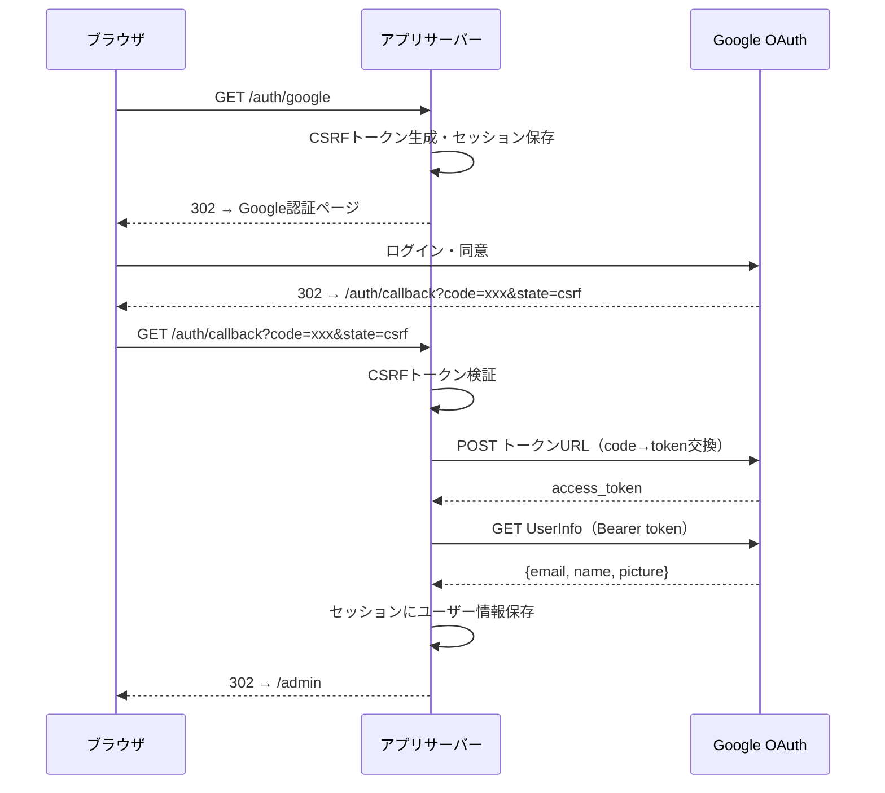

# 10. 認証・認可仕様

## 10.1 概要

Google OAuth 2.0 による管理者認証。Google Workspace の内部アプリとして設定されており、組織外ユーザーはログイン不可。

管理APIエンドポイント（`admin/*`）はAxumミドルウェアによるサーバーサイド認証で保護される。未認証リクエストは一律 401 Unauthorized で拒否される。

---

## 10.2 OAuth2フロー詳細

### 前提条件（環境変数）

| 環境変数 | 説明 | 必須 |
|---------|------|:----:|
| `GOOGLE_CLIENT_ID` | OAuth2 クライアントID | ○ |
| `GOOGLE_CLIENT_SECRET` | OAuth2 クライアントシークレット | ○ |
| `APP_URL` | アプリケーションURL（コールバックURL構築用） | ○ |
| `ADMIN_EMAILS` | 許可メールアドレス（カンマ区切り） | ○ |

上記4つはすべて **起動時に必須** である。未設定の場合、アプリケーションは起動時にパニックする（`envy::from_env().expect()`）。

### Google OAuth2 エンドポイント

| 用途 | URL |
|------|-----|
| 認証URL | `https://accounts.google.com/o/oauth2/v2/auth` |
| トークンURL | `https://oauth2.googleapis.com/token` |
| UserInfo URL | `https://www.googleapis.com/oauth2/v2/userinfo` |

### OAuth2 フローシーケンス

### スコープ

| スコープ | 用途 |
|---------|------|
| `email` | メールアドレス取得 |
| `profile` | 表示名・プロフィール画像取得 |

### CSRF保護

1. `/auth/google` でランダムなCSRFトークンを生成
2. トークンをセッションに `oauth_csrf` キーで保存
3. Google認証URLの `state` パラメータにトークンを設定
4. `/auth/callback` でセッションのCSRFトークンと `state` クエリパラメータを照合
5. 不一致の場合は `/admin?error=csrf_mismatch` にリダイレクト

---

## 10.3 エラーコード

OAuthフロー中のエラーは、すべて `/admin?error={code}` へのリダイレクトで処理される。

| エラーコード | 発生タイミング | 説明 |
|------------|-------------|------|
| `oauth_not_configured` | `/auth/google` または `/auth/callback` | OAuth環境変数が未設定（※到達不能：起動時に必須チェック済み） |
| `session_error` | `/auth/google` または `/auth/callback` | セッションへの書き込み失敗（CSRF保存 or ユーザー保存） |
| `csrf_mismatch` | `/auth/callback` | CSRFトークン不一致（改ざんまたはセッション切れ） |
| `token_exchange_failed` | `/auth/callback` | 認証コード→アクセストークン交換失敗 |
| `userinfo_failed` | `/auth/callback` | Google UserInfo APIへのリクエスト失敗 |
| `userinfo_parse_failed` | `/auth/callback` | UserInfoレスポンスのJSON解析失敗 |

---

## 10.4 セッション管理

### セッションキー

| キー | 値の型 | 用途 |
|------|-------|------|
| `user` | `AuthUser { email, name, picture }` | 認証済みユーザー情報 |
| `oauth_csrf` | `String` | OAuth CSRF トークン（一時的、コールバック後に削除） |

### セッションストア

- **ストア**: Valkey（Redis互換、`tower-sessions-redis-store` + `fred`）

### Cookie設定

セッションCookieは `tower-sessions` のデフォルト設定に従う。

---

## 10.5 認証API

### auth/configured — OAuth設定有無確認

- **実装**: `app/src/common/handlers/auth/is_oauth_configured.rs`
- **判定条件**: `google_client_id`, `google_client_secret`, `app_url` の3項目すべてが `Some`
- **レスポンス**: `bool`
- **備考**: 環境変数は起動時に必須チェックされるため、実行時は常に `true` を返す（レガシーAPI）

### auth/me — 認証ユーザー取得

- **実装**: `app/src/common/handlers/auth/get_auth_user.rs`
- **処理**: セッションから `user` キーを取得
- **レスポンス**: `Option<AuthUser>`（未認証時は `None`）

---

## 10.6 サーバーサイド認証ミドルウェア

### 概要

管理APIの認証はAxumミドルウェアで一括適用する。`admin_routes()` に `route_layer` として認証チェックミドルウェアを設定し、全管理エンドポイントを保護する。

### ミドルウェア仕様

- **適用対象**: `admin_routes()` 配下の全エンドポイント
- **処理フロー**:
  1. リクエストからセッションを取得
  2. セッションの `user` キーから `AuthUser` を取得
  3. `AuthUser` が存在すれば → リクエストを通過させる
  4. `AuthUser` が存在しなければ → 401 Unauthorized を返す
- **認可粒度**: 認証済みであれば全管理機能を許可（ロール区別なし）

### 環境変数に関する補足

OAuth環境変数（`GOOGLE_CLIENT_ID`, `GOOGLE_CLIENT_SECRET`, `APP_URL`, `ADMIN_EMAILS`）は起動時に必須チェックされるため、未設定の状態でアプリケーションが動作することはない。開発環境でもOAuth設定が必須である。

### エラーレスポンス

| 条件 | HTTPステータス | レスポンスボディ |
|------|-------------|---------------|
| 未認証（セッションなし / `user` キーなし） | 401 Unauthorized | `"Unauthorized"` |
| セッション取得失敗 | 401 Unauthorized | `"Unauthorized"` |

### Leptos Server Function との統合

Leptos Server Function は内部的にAxumルーターを通るため、ミドルウェアが適用される。Server Function 内での個別認証チェックは不要。

---

## 10.7 UIレベル認証表示

**実装**: `app/src/front/pages/admin_page/layout.rs` — `AdminLayout` コンポーネント

UIレベルの表示制御はUXのために維持するが、セキュリティ境界ではない。実際のアクセス制御はサーバーサイドミドルウェア（10.6）が担う。

### 動作

1. `is_oauth_configured()` で OAuth 設定有無を取得
2. `get_auth_user()` で認証ユーザーを取得
3. 以下の条件でUI表示を分岐:

| 認証状態 | 表示 |
|---------|------|
| 認証済み | ユーザーメール表示 + ログアウトリンク |
| 未認証 | 管理画面コンテンツの上にログインオーバーレイを表示 |

> **備考**: OAuth環境変数は起動時に必須のため「未設定」状態は発生しない。UIの `is_oauth_configured()` チェックはレガシーコードとして残存しているが、常に `true` を返す。

### ログインオーバーレイ

- **CSSクラス**: `login_overlay` + `login_required`
- **内容**: 「ログインが必要です」メッセージ + 「Googleでログイン」ボタン
- **動作**: コンテンツは裏に描画済みだが、オーバーレイで操作不能にする

### features Cookie管理

`AdminLayout` には `features=local` Cookie の切り替えトグルが含まれる。

- **ON**: `document.cookie = "features=local; path=/"` を設定
- **OFF**: Cookie を削除（`max-age=0`）
- **クライアントサイドのみ**: `#[cfg(feature = "hydrate")]` ガード

---

## 10.8 セキュリティ上の制約

| 制約 | 説明 | リスク |
|------|------|-------|
| Google Workspace制限 | 組織外ユーザーはGoogleログイン不可 | Google Workspace設定に依存 |
| ログアウト処理 | サーバーサイドセッション削除のみ（Googleトークン無効化なし） | Googleセッションは残る |
| プレビュー認証なし | `/preview/{id}` はURLを知っていれば誰でもアクセス可能 | プレビュー記事表示に認証なし |
