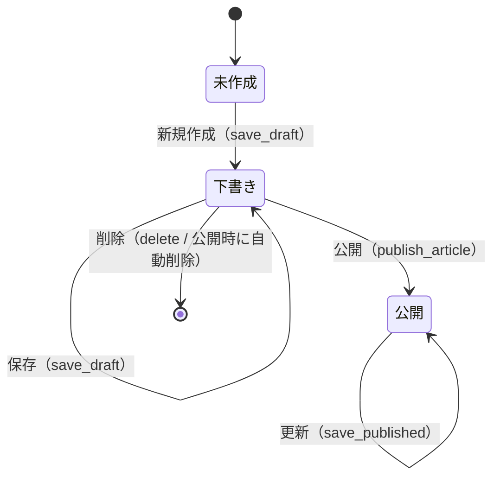
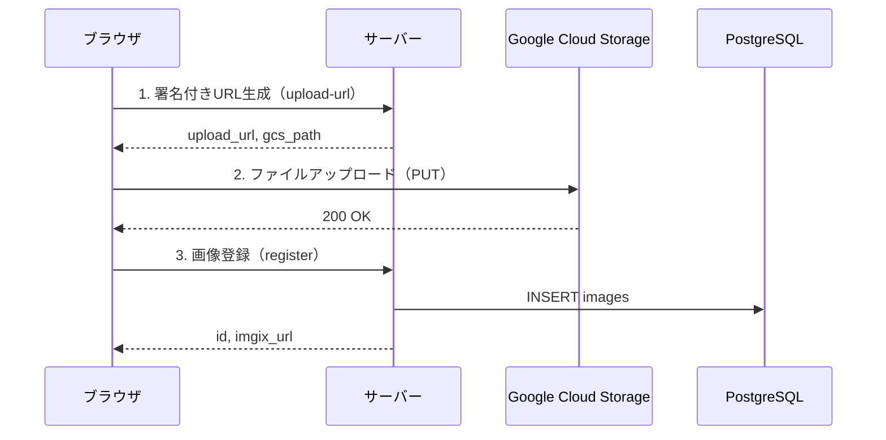
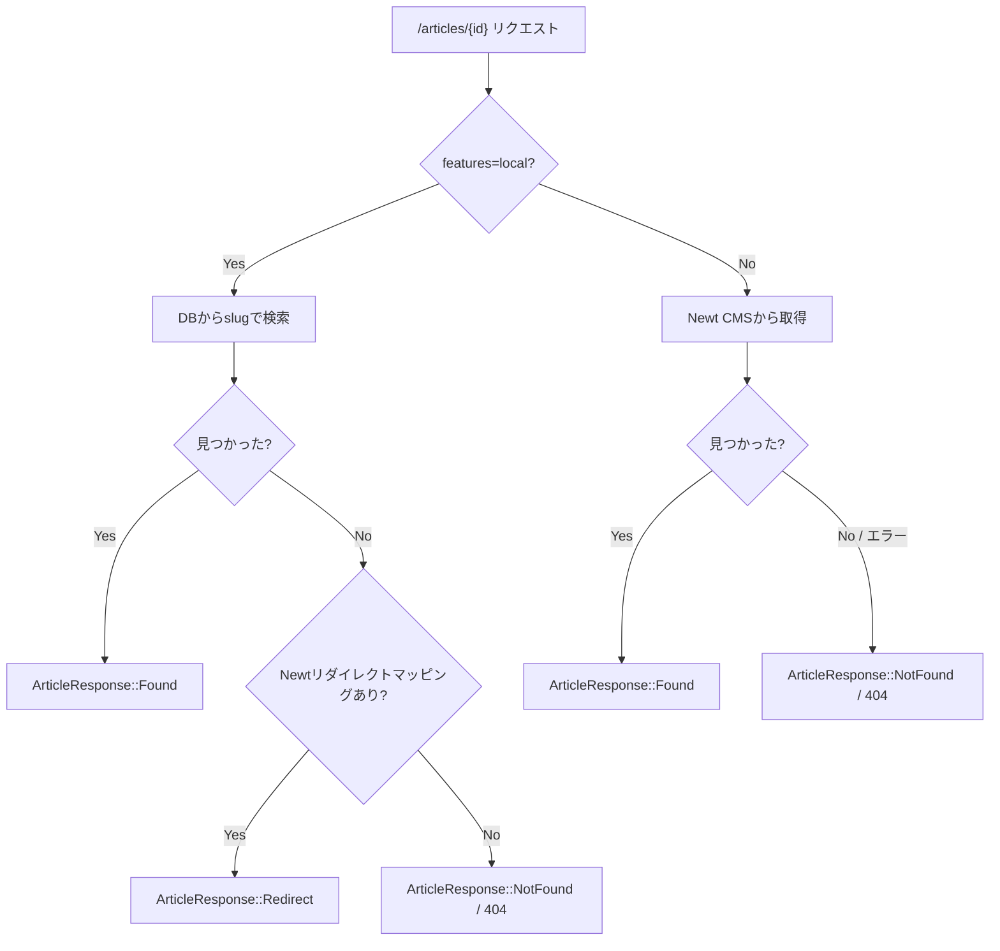

# 11. 状態遷移仕様

## 11.1 記事ライフサイクル

### 状態遷移図

### 状態一覧

| 状態 | テーブル | 説明 |
|------|---------|------|
| 未作成 | — | IDがクライアントで生成された直後（DBにレコードなし） |
| 下書き | `draft_articles` | バリデーション緩和、タイトル・スラッグ・本文すべて空許可 |
| 公開 | `published_articles` | バリデーション厳格、`published_at` 設定済み |

### 各遷移の詳細

#### 未作成 → 下書き（新規作成）

- **トリガー**: `admin/save_draft` API（Upsert動作）
- **入力**: クライアントで生成したUUID、タイトル、スラッグ、本文、説明文
- **バリデーション**: なし
- **データ変換**: そのまま `draft_articles` テーブルに INSERT
- **副作用**: `created_at`, `updated_at` に現在時刻UTC設定

#### 下書き → 下書き（更新）

- **トリガー**: `admin/save_draft` API（Upsert動作）
- **入力**: 既存の記事ID、更新後のタイトル・スラッグ・本文・説明文
- **バリデーション**: なし
- **データ変換**: `draft_articles` テーブルを UPDATE
- **副作用**: `updated_at` を現在時刻UTCで更新

#### 下書き → 公開

- **トリガー**: `admin/publish_article` API
- **入力**: 下書き記事ID
- **バリデーション**:
  1. 下書きの存在確認（`NotFound` エラー）
  2. `PublishedArticleSlug::new()` でスラッグバリデーション
  3. `published_articles` テーブルでのスラッグ重複チェック
- **データ変換**:
  1. 下書きのフィールドを公開記事レコードにコピー
  2. `published_at` = 現在時刻UTC を設定
  3. カテゴリ（`draft_article_categories`）を `published_article_categories` にコピー
- **副作用**:
  1. 公開記事レコード INSERT
  2. カテゴリ関連レコード INSERT
  3. 下書きレコード DELETE
- **不可逆**: 公開後に下書きに戻すことはできない

#### 公開 → 公開（更新）

- **トリガー**: `admin/save_published` API
- **入力**: 公開記事ID、タイトル、スラッグ、本文、説明文
- **バリデーション**:
  1. `PublishedArticleTitle::new()` でタイトルバリデーション
  2. `PublishedArticleSlug::new()` でスラッグバリデーション
  3. スラッグ重複チェック（自身を除外）
- **データ変換**: `published_articles` テーブルを UPDATE
- **副作用**: `updated_at` を現在時刻UTCで更新

### 存在しない遷移

| 遷移 | 理由 |
|------|------|
| 公開 → 下書き | 未実装。公開記事を非公開にする機能なし |
| 公開 → 削除 | 未実装。公開記事の削除機能なし |
| 下書き → 削除（UI） | 管理画面UIからの削除機能は未実装。DB直接操作でのみ可能 |

---

## 11.2 画像アップロードフロー

画像アップロードは3ステップで行われる。各ステップは独立したAPI呼び出しであり、途中で失敗した場合の自動ロールバックはない。

### フロー図

### 各ステップの詳細

#### ステップ1: 署名付きURL生成

- **API**: `admin/images/upload-url`
- **入力**: ファイル名、MIMEタイプ、ファイルサイズ
- **処理**:
  1. MIMEタイプ・ファイルサイズのバリデーション
  2. GCSパス生成: `{prefix}/images/{uuid_v7}/{filename}`
  3. 署名付きPUT URL生成（有効期限: 15分）
- **成功時の状態**: サーバー/DB状態は変化なし（URLが返されるだけ）
- **失敗時の状態**: 影響なし

#### ステップ2: GCSアップロード

- **操作**: クライアントから GCS に直接 PUT リクエスト（署名付きURL使用）
- **成功時の状態**: GCS上にファイルが存在するが、DBには未登録
- **失敗時の状態**: GCS上にファイルなし。ステップ1からやり直し可能

#### ステップ3: 画像DB登録

- **API**: `admin/images` (POST)
- **入力**: ファイル名、GCSパス、MIMEタイプ、ファイルサイズ、幅、高さ、代替テキスト
- **処理**:
  1. MIMEタイプ・ファイルサイズの再バリデーション
  2. GCSパス重複チェック
  3. DB INSERT
- **成功時の状態**: DB・GCS両方に画像が存在
- **失敗時の状態**: GCSにファイルは存在するが、DBには未登録（孤立ファイル）

### 失敗時の状態まとめ

| 失敗箇所 | GCS状態 | DB状態 | 復旧方法 |
|---------|---------|--------|---------|
| ステップ1失敗 | なし | なし | 再試行 |
| ステップ2失敗 | なし | なし | ステップ1からやり直し |
| ステップ3失敗 | ファイル残存 | なし | GCSに孤立ファイルが残る。手動削除が必要 |

### 画像削除

- **API**: `admin/images/delete`
- **処理**: DBレコードのみ削除
- **GCSファイル**: 削除されない（孤立ファイルが残る）

---

## 11.3 記事表示の分岐フロー

記事詳細ページ（`/articles/{id}`）は、`features=local` Cookie の有無で表示ロジックが大きく分岐する。

### フロー図

### 分岐詳細

| Cookie | 優先ソース | フォールバック | キャッシュ |
|--------|----------|-------------|----------|
| `features=local` あり | ローカルDB（slug検索） | Newtリダイレクトマッピング | キャッシュ無効化 |
| `features=local` なし | Newt CMS（ID検索） | — | 記事ページキャッシュ |

### リダイレクト処理

`features=local` 時に、Newt CMS の記事IDに対応するローカル記事のslugマッピングが存在する場合:

- **SSR時**（Accept: text/html）: 301 Moved Permanently + `Location` ヘッダ
- **クライアントナビゲーション時**: `ArticleResponse::Redirect(url)` でクライアント側リダイレクト
