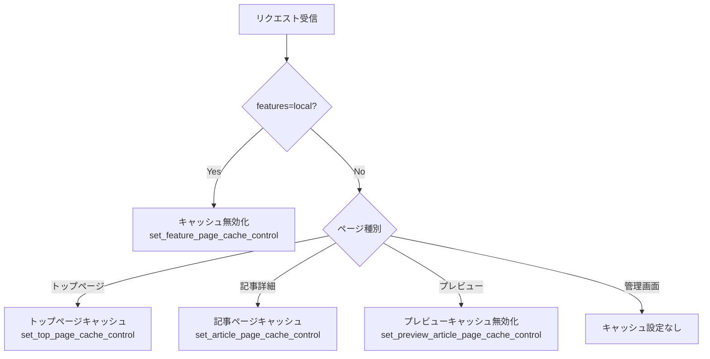

# 12. キャッシュ制御仕様

## 12.1 概要

ページ種別ごとに `Cache-Control` と `CDN-Cache-Control` ヘッダを設定し、ブラウザキャッシュとCDNキャッシュを制御する。

**実装箇所**:
- `app/src/server/http/response.rs` — 実際のヘッダ設定関数
- `app/src/common/response.rs` — 重複設定防止ラッパー

---

## 12.2 ページ種別ごとのCache-Control値

### トップページ / 記事詳細ページ

**関数**: `set_top_page_cache_control()`, `set_article_page_cache_control()`

| ヘッダ | 値 |
|--------|-----|
| `Cache-Control` | `no-cache, must-revalidate, max-age=10, stale-while-revalidate=1296000` |
| `CDN-Cache-Control` | `max-age=1296000, stale-while-revalidate=1296000` |

**解説**:
- ブラウザ: 10秒でキャッシュ期限切れ、必ず再検証。ただし裏で15日間のstale-while-revalidateで古いキャッシュを表示しつつ更新
- CDN: 15日間キャッシュ（1296000秒 = 15日）

### プレビューページ / features=local ページ

**関数**: `set_preview_article_page_cache_control()`, `set_feature_page_cache_control()`

| ヘッダ | 値 |
|--------|-----|
| `Cache-Control` | `no-cache, must-revalidate, no-store, max-age=0, stale-while-revalidate=0, private` |
| `CDN-Cache-Control` | `no-cache, must-revalidate, no-store, max-age=0, stale-while-revalidate=0, private` |

**解説**:
- ブラウザ・CDN共にキャッシュ完全無効化
- `private` — CDNキャッシュも禁止
- プレビュー（未公開記事）と features=local（開発用ローカル記事表示）で使用

### 管理ページ

管理API（`admin/*`）にはキャッシュ制御ヘッダを設定しない。デフォルトの動作に従う。

---

## 12.3 重複設定防止メカニズム

**問題**: Leptos SSRでは、1つのリクエスト内で複数のServer Functionが呼ばれることがある（例: トップページで `get_articles_handler` と `get_author_handler` が両方呼ばれる）。各関数がキャッシュヘッダを設定すると、後から設定した値で上書きされてしまう。

**解決策**: `CacheControlSet` フラグ

**定義**: `app/src/common/response.rs`

```rust
pub struct CacheControlSet(pub Arc<AtomicBool>);
```

**動作**:
1. リクエストコンテキストに `CacheControlSet` を登録（初期値: `false`）
2. キャッシュ設定関数の呼び出し時に `is_set()` を確認
3. 未設定（`false`）の場合のみヘッダを設定し、`mark_set()` で `true` に更新
4. 設定済み（`true`）の場合はスキップ

**適用範囲**: トップページキャッシュ（`set_top_page_cache_control`）と features=local キャッシュ無効化（`set_feature_page_cache_control`）に適用。記事ページキャッシュ（`set_article_page_cache_control`）とプレビュー（`set_preview_article_page_cache_control`）には未適用（1リクエスト内で1回のみ呼ばれるため）。

---

## 12.4 キャッシュ設定の決定フロー



**優先順位**: `features=local` が設定されている場合、ページ種別に関わらずキャッシュ無効化が最優先。
